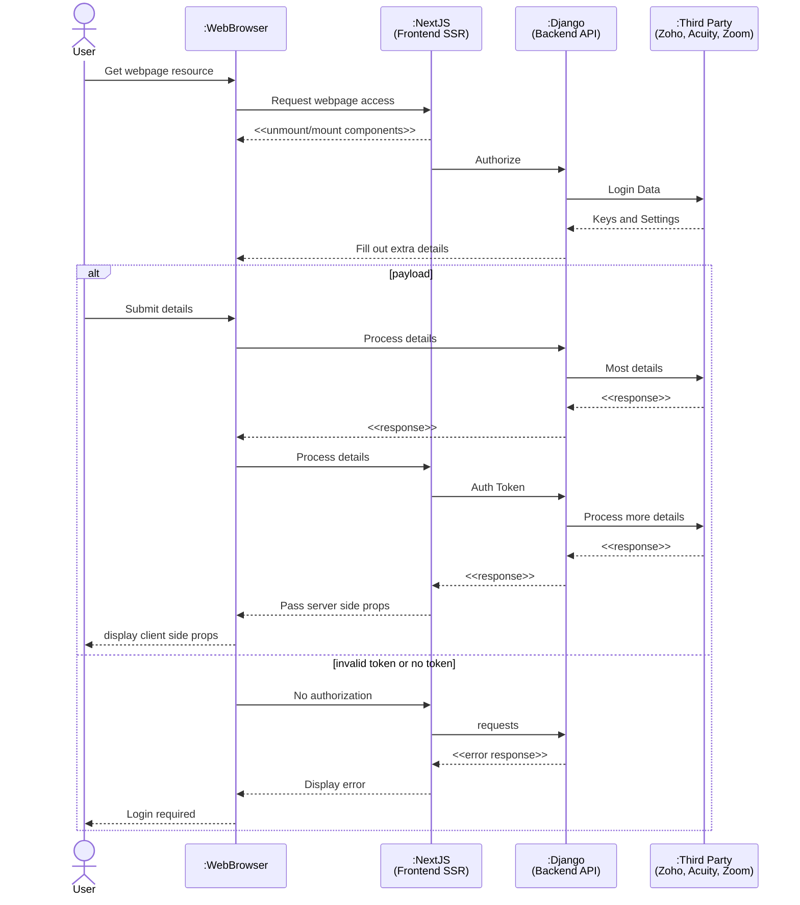

# Authentication and Access Sequence Diagram

---
**🔑 Key Details Mapped**

- **Participants:**  
  Aliases (WB, NJ, DJ, TP) are used in the diagram for brevity. Each alias is shown with a descriptive name matching the boxes from your image.

- **Line Styles:**  
  - `->>` — **Solid lines** denote synchronous requests.  
  - `-->>` — **Dashed lines** indicate responses or returned data.

- **Grouping:**  
  The bottom "large box" is depicted with an `alt` block, visually splitting the flow into:  
  - **Payload Success Path:** (“payload”)  
  - **Invalid Token Failure Path:** (“invalid token or no token”)

---
